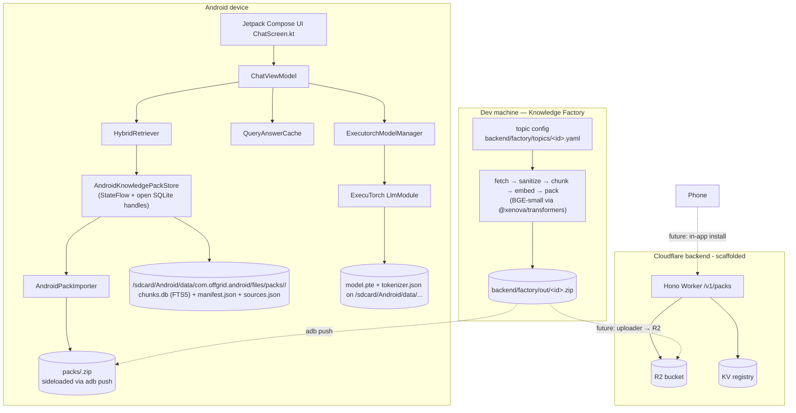

# Offgrid — Version 1 Development Notes

## Overview

Offgrid is a mobile-first, fully offline AI assistant. The phone runs a quantized LLM locally (Qwen3-1.7B via ExecuTorch) and answers from a small in-memory knowledge store, with a planned upgrade path to downloadable curated "knowledge packs" hosted on Cloudflare. Version 1 represents the working baseline: real on-device generation, a polished minimal UI, and the architectural primitives in place for the curated-pack pipeline that follows.

The project is intentionally not a research stack. Every choice favors something shipping today over an idealized future, with explicit hooks where the future can plug in without rewrites.

## What's working in v1

- On-device chat with Qwen3-1.7B running through ExecuTorch's `LlmModule`.
- Streamed token output rendered in real time in Jetpack Compose.
- A heuristic + sanitizer pipeline that suppresses internal monologue (echoed system prompts, "thinking" narration, repetitive loops).
- A minimal black-on-white UI with a `Chat | Knowledge` switcher.
- A **Knowledge Factory** (Node script, `backend/factory/`) that turns a YAML topic config into a real ZIP pack: Wikipedia fetch → cheerio + Readability sanitize → semantic chunker → BGE-small embeddings → manifest + chunks.jsonl + embeddings.f32 + sources.json + README, all zipped.
- **On-device pack consumption**: sideload a pack ZIP via `adb push`, the app auto-imports it into a per-pack SQLite + FTS5 store, and the chat retriever runs BM25 across installed packs and injects `[Source: …]` tags into the prompt.
- A `QueryAnswerCache` (24 h TTL) that short-circuits identical questions.
- A Cloudflare Worker scaffold (Hono + R2 + KV) ready to serve a future static catalog of pack files when we move from sideload to in-app download (next stage).

## High-level architecture



Today the on-device half is fully wired (model + pack store + retriever + UI), the dev-machine factory produces real packs, and the sideload path connects the two. The Worker exists as a placeholder for Phase 2 Stage 3 (in-app download).

## Module layout

The repo is a Kotlin Multiplatform project with one Android target plus a separate Cloudflare Worker backend.

```
offgrid/
├── settings.gradle.kts             # KMP root, includes :shared and :androidApp
├── build.gradle.kts                # Root plugins
├── gradle.properties               # JVM args, AndroidX, Kotlin code style
├── shared/                         # KMP library (commonMain + androidMain)
│   ├── build.gradle.kts
│   └── src/
│       ├── commonMain/kotlin/com/offgrid/shared/
│       │   ├── models/ChatModels.kt
│       │   ├── ai/ModelManager.kt
│       │   ├── ai/Tokenizer.kt
│       │   ├── knowledge/KnowledgePack.kt          # value types
│       │   ├── knowledge/KnowledgePackStore.kt     # interface
│       │   ├── knowledge/HybridRetriever.kt        # builds prompt with [Source: …] tags
│       │   └── rag/QueryAnswerCache.kt             # 24h TTL cache, kotlinx-datetime
│       └── androidMain/kotlin/com/offgrid/shared/
│           ├── ai/ExecutorchModelManager.kt
│           ├── ai/JsonVocabTokenizer.kt
│           ├── ai/MockModelManager.kt
│           ├── knowledge/AndroidPackImporter.kt    # ZIP → SQLite + FTS5
│           └── knowledge/AndroidKnowledgePackStore.kt  # FTS5 BM25 across packs
├── androidApp/
│   ├── build.gradle.kts            # noCompress += "pte" so APK packaging won't OOM on model assets
│   └── src/main/
│       ├── AndroidManifest.xml
│       ├── kotlin/com/offgrid/android/
│       │   ├── MainActivity.kt
│       │   ├── ChatViewModel.kt
│       │   └── ChatScreen.kt
│       └── assets/models/...       # Tokenizer files for Qwen3-1.7B (model.pte lives off-device)
├── backend/
│   ├── factory/                    # Knowledge Factory (dev-machine Node script)
│   │   ├── package.json
│   │   ├── tsconfig.json
│   │   ├── README.md
│   │   ├── topics/                 # YAML topic configs
│   │   │   ├── chess-openings-beginner.yaml
│   │   │   ├── guitar-basics.yaml
│   │   │   ├── japan-travel-essentials.yaml
│   │   │   ├── first-aid-basics.yaml
│   │   │   └── knots-essential.yaml
│   │   ├── out/                    # generated *.zip packs (gitignored)
│   │   └── src/
│   │       ├── index.ts            # CLI: `npm run build <topic-id>` / `list` / `--dry-run`
│   │       ├── topicConfig.ts      # YAML loader + zod schema
│   │       ├── sources/wikipedia.ts
│   │       ├── sources/registry.ts
│   │       ├── sanitize.ts         # cheerio + Readability + turndown + link strip
│   │       ├── chunker.ts          # semantic, overlap, H2/H3 section paths
│   │       ├── embedder.ts         # BGE-small via @xenova/transformers (dynamic import)
│   │       ├── packer.ts           # ZIP assembly + sha256
│   │       └── types.ts
│   ├── package.json                # Cloudflare Worker (separate from factory)
│   ├── tsconfig.json
│   ├── wrangler.toml
│   └── src/
│       ├── index.ts                # Hono routes: /v1/packs, /v1/packs/:id, /v1/packs/:id/download
│       └── pipeline/buildPack.ts   # Stub for future content pipeline
├── models/                          # Local-only HF clones (not committed)
│   ├── SmolLM2-135M/
│   └── Qwen3-1.7B-INT8-INT4-ExecuTorch-XNNPACK/
└── version1.md
```

## File-by-file notes

### `shared/` (KMP)

| File | Role |
|---|---|
| `commonMain/models/ChatModels.kt` | `ChatMessage`, `ChatUiState` (with `isRetrieving` flag), `AppResult` sealed result type. |
| `commonMain/ai/ModelManager.kt` | Cross-platform interface: `loadModel`, `streamResponse(prompt): Flow<String>`, `stopGeneration`, `unloadModel`. |
| `commonMain/ai/Tokenizer.kt` | Minimal `Tokenizer` interface plus `WhitespaceTokenizer` placeholder. The real path uses ExecuTorch's bundled tokenizer via `LlmModule`. |
| `commonMain/knowledge/KnowledgePack.kt` | `KnowledgePack` (manifest mirror) + `RetrievedChunk` (text + sourceLabel + sectionPath + packId). |
| `commonMain/knowledge/KnowledgePackStore.kt` | Interface: `installed(): StateFlow<List<KnowledgePack>>`, `refresh()` (re-scan + import new ZIPs), `search(query, topK): List<RetrievedChunk>`. |
| `commonMain/knowledge/HybridRetriever.kt` | Builds the chat prompt: delegates to `store.search`, then formats `Context:\n[Source: <article> > <section>]\n<chunk>\n\n[Source: …]\n…\n\nQuestion: <text>`. Returns the bare query when retrieval is empty (no "no knowledge found" filler). |
| `commonMain/rag/QueryAnswerCache.kt` | 24h TTL cache keyed by normalized query, via `kotlinx-datetime`. |
| `androidMain/ai/ExecutorchModelManager.kt` | The real on-device runtime. Resolves `model.pte` and `tokenizer.json` from `getExternalFilesDir`, instantiates `LlmModule`, streams via `LlmCallback.onResult`, normalizes raw output to strip role markers, `<think>` blocks, and monologue paragraphs. |
| `androidMain/ai/JsonVocabTokenizer.kt` | Lightweight vocab-only fallback tokenizer (kept for reference; not used in the streamed path). |
| `androidMain/ai/MockModelManager.kt` | Mock streamer for emulator/no-model runs; useful when `ExecutorchModelManager.loadModel` returns an error. |
| `androidMain/knowledge/AndroidPackImporter.kt` | Idempotent ZIP→SQLite importer. Whitelists entry names (zip-slip protection), copies raw files into `<external>/packs/<id>/`, builds `chunk_meta` + `sources` + `chunks(fts5)` tables, writes a `.imported` sentinel on success. |
| `androidMain/knowledge/AndroidKnowledgePackStore.kt` | `KnowledgePackStore` impl. Owns open SQLite handles per pack, exposes `installed: StateFlow`, runs FTS5 `MATCH` per pack and merges by BM25 score across packs. Sanitizes user queries into FTS5 expressions (lowercase + drop short tokens + small stopword list + OR-join quoted terms). |

### `androidApp/` (UI)

| File | Role |
|---|---|
| `MainActivity.kt` | Wires up `AndroidKnowledgePackStore`, `HybridRetriever`, `QueryAnswerCache`, `ExecutorchModelManager`, and a single `ChatViewModel`. Closes the pack store in `onDestroy`. Applies the white `lightColorScheme` Material theme. |
| `ChatViewModel.kt` | Holds `ChatUiState`. Sends user messages, consults `QueryAnswerCache`, calls `retriever.buildPrompt(text)` (suspend, runs FTS5 across installed packs), collects streamed tokens off `Dispatchers.IO`, exposes `stopGeneration`, `installedPacks: StateFlow<List<KnowledgePack>>`, `isRefreshingPacks: StateFlow<Boolean>`, and `refreshPacks()`. |
| `ChatScreen.kt` | Composables: `OffgridApp` (white root + title + tabs), `ChatPanel` with empty-state hint, `UserMessageRow` (right-aligned soft gray bubble), `AssistantMessageRow` (small "OFFGRID" label + plain text), `InputRow` (borderless `BasicTextField` + black pill `Send`/`Stop`), `KnowledgePanel` listing real installed packs (title · description · version · `<chunks> · <sources> · <size>`) with a `Refresh` pill, and a step-by-step empty-state hint walking through `npm run build` → `adb push` → tap Refresh. |

### `backend/factory/` (Knowledge Factory — dev-machine Node)

| File | Role |
|---|---|
| `src/index.ts` | CLI: `tsx src/index.ts build <id> [--dry-run]` runs the full pipeline; `list` lists topic configs. |
| `src/topicConfig.ts` | YAML loader + zod schema. Validates `id`, `title`, `description`, `tags`, `sources` (discriminated union; `wikipedia` only for now), `maxChunks`, `maxBytes`. |
| `src/sources/wikipedia.ts` | Wikipedia REST `action=parse` fetcher with one-hop link-follow + keyword-filter. UA-tagged. Skips `File:`/`Special:`/`Category:`/`Template:`/`Wikipedia:` namespaces. |
| `src/sources/registry.ts` | Per-`kind` dispatcher; today `wikipedia` only. |
| `src/sanitize.ts` | cheerio prune of noisy selectors → linkedom + Mozilla Readability for residual boilerplate → turndown ATX-heading markdown → markdown-link strip (handles backslash-escaped parens) → wiki cruft regex sweep. |
| `src/chunker.ts` | Section-aware semantic chunker. Targets ~512 tokens / 2000 chars, max 3200, min 200, with ~12 % overlap (last 1–2 sentences carried into the next chunk). |
| `src/embedder.ts` | BGE-small-en-v1.5 via `@xenova/transformers`, **dynamic import** so `--dry-run` skips loading transformers entirely. Mean-pooled, normalized 384-dim float32 vectors, batched by 32. |
| `src/packer.ts` | ZIP assembly: `manifest.json` (with `sha256` over chunks+embeddings+sources, content-hashed before zip), `chunks.jsonl`, `embeddings.f32` (raw little-endian Float32, `numChunks × 384`), `sources.json`, `README.md`. Two-pass to backfill `sizeBytes` into the manifest. |
| `src/types.ts` | Shared interfaces. |
| `topics/<id>.yaml` | Topic configs: chess-openings-beginner (smoke-tested), guitar-basics, japan-travel-essentials, first-aid-basics, knots-essential. |
| `out/<id>.zip` | Generated pack output (gitignored). |

### `backend/` (Cloudflare Worker — scaffold only)

| File | Role |
|---|---|
| `src/index.ts` | Hono routes: `GET /v1/packs` lists pack manifests from KV, `GET /v1/packs/:id` returns one, `GET /v1/packs/:id/download` returns the R2 URL (placeholder path today). |
| `src/pipeline/buildPack.ts` | Stub for any future server-side build path. |
| `wrangler.toml` | Bindings for `PACKS_R2` (R2 bucket) and `PACKS_REGISTRY` (KV namespace). |

## How chat actually flows today

1. User taps **Send** → `ChatViewModel.sendMessage(text)`.
2. `QueryAnswerCache` is consulted; if a fresh answer for the same normalized query exists (24 h TTL), it's returned immediately.
3. Otherwise `HybridRetriever.buildPrompt(text)` is called. It asks `AndroidKnowledgePackStore.search(query, topK=4)` which:
   a. Sanitizes the query (lowercase → drop non-alphanumerics → drop short tokens + small stopword list → OR-join quoted terms).
   b. Runs `SELECT … bm25(chunks) AS score FROM chunks JOIN chunk_meta … WHERE chunks MATCH ? ORDER BY score LIMIT topK` against every installed pack DB.
   c. Merges hits across packs by ascending score (FTS5 bm25 returns negatives where lower = better) and keeps the global top-K.
4. The prompt is wrapped in a Qwen ChatML template by `ExecutorchModelManager.formatAsChatPrompt`:
   ```
   <|endoftext|><|im_start|>system
   You are Offgrid, a practical offline assistant on the user's phone. Answer concisely in plain language, using lists or steps when useful. Ground answers in any context provided. If you don't know something, say so.
   <|im_end|>
   <|im_start|>user
   <RAG context (if any) followed by the question>
   <|im_end|>
   <|im_start|>assistant
   ```
   When retrieval returns chunks, the user message is shaped as:
   ```
   Context:
   [Source: Wikipedia: Italian Game > Theory > Main lines]
   The Italian Game starts 1.e4 e5 2.Nf3 Nc6 3.Bc4. White's bishop on c4 …

   [Source: Wikipedia: Ruy Lopez]
   The Ruy Lopez (1.e4 e5 2.Nf3 Nc6 3.Bb5) develops the bishop and …

   Question: What's the difference between the Italian Game and the Ruy Lopez?
   ```
   When retrieval returns nothing, the user message is just the bare question — no "no local knowledge" filler that the model could echo.
5. `LlmModule.generate(prompt, LlmGenerationConfig{ maxNewTokens=384, seqLen=1024, echo=false, temperature=0.1 }, callback)` streams tokens through `LlmCallback.onResult`.
6. Each accumulated chunk is run through `normalizeGeneratedText`:
   - Strip `<think>...</think>` blocks (multiline).
   - Strip role markers (`<|im_start|>`, `<|im_end|>`, etc).
   - Compact whitespace.
   - **Drop the leading paragraph if it looks like monologue** (contains any of `~30` signal phrases such as `"keep it simple"`, `"the user is"`, `"as an ai"`, `"based on the context"`).
   - Run line-level regex sweeps for residual narration patterns ("Let me think…", "I should…").
   - Trim leading non-letter junk and bail out at the first `Question:` / `User:` block if the model spirals.
7. Repetition guard: if the tail of the buffer repeats the same N-gram several times in a row, stop generation and reset the model context.
8. The cleaned token delta is sent to the UI via a Compose `Flow<String>` collector, which appends it to the assistant message; the `LazyColumn` auto-scrolls.

## Decisions and tradeoffs

| Choice | Why |
|---|---|
| Kotlin Multiplatform + Jetpack Compose (Android first) | Native Android performance, first-class ExecuTorch Android binding, faster iteration than a React Native + bridge approach. iOS shares the `commonMain` interfaces when we add it. |
| ExecuTorch `LlmModule` instead of llama.cpp/MLC/ONNX | It's the canonical PyTorch on-device path with a published Maven artifact (`org.pytorch:executorch-android:1.1.0`) and a stable `LlmCallback` streaming API. |
| Qwen3-1.7B (4-bit) instead of Qwen 7B | 7B at 4-bit is ~4 GB on disk and pushes mid-range Android RAM hard; 1.7B at INT4 is ~1.2 GB and gives acceptable latency on a Pixel-class device. We can revisit 7B later if measured demand justifies it. |
| Model file lives off-APK | Bundling a 1.2 GB `.pte` blew up `:packageDebug` with an integer-overflow during compression. Fix: `androidResources { noCompress += listOf("pte") }` plus loading from `getExternalFilesDir(null)` after `adb push`. Build stays fast, model is replaceable without reinstalling. |
| `kotlinx-datetime` for timestamps | Avoids `java.time` dependency from `commonMain`; needed for `QueryAnswerCache` TTL. |
| `darkColorScheme` → `lightColorScheme`, all borders removed | Borders made the UI look prototypical and noisy. Soft gray user bubbles + plain assistant text on white reads as a real product. |
| Identity-first system prompt + paragraph-level sanitizer | Verbose negative instructions ("do not output `<think>` tags", "do not repeat yourself") provoked the model into echoing them back as a first paragraph. The current prompt instead positions Offgrid as a practical offline tool with positive instructions only (concise, plain language, lists/steps when useful, ground in context, admit unknowns). Pairs with a sanitizer that drops monologue paragraphs the model still occasionally produces. |
| `[Source: …]` tagged RAG context, no "no knowledge found" fallback | Source tags help the 1.7B model distinguish chunks from different modules and lay the groundwork for Phase 2 citations. Removing the "No local knowledge found" filler eliminated a class of monologue leakage where the model riffed on that phrase. |
| FTS5 BM25 over per-pack SQLite, no on-device embedder yet | FTS5 is built into Android's bundled SQLite — zero new native deps, instant queries on the small (a-few-hundred-chunk) packs we ship. Embeddings are precomputed in the factory and shipped *with* the pack, so a Phase 3 hybrid retriever can plug in without re-importing. Adding a 30 MB ONNX BGE-small + onnxruntime to the APK only pays off when measured retrieval quality demands it. |
| One SQLite DB per pack | Trivial install/uninstall (delete the directory), no schema migrations spanning packs, opens scale with installed count not catalog size, and FTS5 indexes stay small/fast. The store keeps DB handles open across queries to avoid per-query open costs. |
| Sideload-first (adb push) before backend download | Decouples the pack-format work from Cloudflare deployment. The factory and the importer / store / retriever can be exercised end-to-end today; the Worker upgrade lands cleanly on top with no app changes beyond an Install button. |
| Knowledge Factory as a separate npm workspace from the Worker | `@xenova/transformers` (and its sharp dep) would never fit a Worker bundle, and we don't want it in the runtime backend's `node_modules`. Two `package.json`s side-by-side keep the runtime artifact small. |
| Cloudflare Workers (Hono) over Python/FastAPI | Always-on edge, generous free tier, native R2 + KV bindings, no infra to babysit. The pack format is portable; if we ever swap runtimes, the contract holds. |

## Known issues / limits

- **Model output quality is bounded by Qwen3-1.7B.** It still occasionally produces over-formal answers, drops obvious facts, or produces partial sentences when generation hits `maxNewTokens`. The sanitizer suppresses meta-narration but cannot improve the underlying reasoning. A larger model is the only real fix.
- **RAG is lexical only.** FTS5 BM25 is solid for keyword-strong queries ("italian game", "open chord G major") but misses synonyms ("how do I tie a strong loop?" doesn't surface the Bowline chunk unless "bowline" is in the question). The factory ships per-chunk embeddings inside the pack, so we can plug a hybrid retriever in later without re-importing.
- **No in-app pack download yet.** Packs are sideloaded via `adb push <zip> /sdcard/Android/data/com.offgrid.android/files/packs/`. Phase 2 Stage 3 lands the Ktor catalog client + WorkManager downloads.
- **FTS5 assumes Android's bundled SQLite has FTS5.** True for ~all modern Android (API 26+), but if a device's SQLite is missing it the import will fail and the pack won't appear in the installed list. We don't fall back to a `LIKE` search yet.
- **Tokenizer is the JSON-vocab path bundled with `LlmModule`.** For unusual tokens (rare unicode, code blocks) behavior is whatever the underlying ExecuTorch tokenizer does. Out of scope to replace.
- **Backend is unreachable.** `wrangler.toml` has placeholder KV ID; no deployment yet. Doesn't block anything because of the sideload path.
- **Pack uninstall isn't exposed in the UI.** Deleting a pack means `adb shell rm -rf /sdcard/Android/data/com.offgrid.android/files/packs/<id>` for now. A Delete button lands with the in-app install UI.

## How to run

Prereqs: macOS or Linux, JDK 17+, an Android SDK with `platform-tools`, and a debug-enabled Android device (or emulator with at least 4 GB RAM).

1. Clone and build:
   ```bash
   ./gradlew :androidApp:installDebug
   ```
2. Grab a working Qwen3-1.7B INT4 export. The repo expects `model.pte` and `tokenizer.json` together.
3. Push them to the app-private external directory (auto-created on first launch):
   ```bash
   ADB=~/Library/Android/sdk/platform-tools/adb
   $ADB push model.pte     /sdcard/Android/data/com.offgrid.android/files/
   $ADB push tokenizer.json /sdcard/Android/data/com.offgrid.android/files/
   ```
4. Launch the app from the launcher. First run takes ~10–30 s while ExecuTorch loads the `.pte`. After that, prompts stream tokens within a second or two.

If `loadModel` fails (file missing or unreadable), the chat falls back to the mock manager so the UI still works.

5. (Optional) Install a Knowledge Pack so chat answers can cite real sources:
   ```bash
   cd backend/factory
   npm install --ignore-scripts          # one-time; sharp install needs a follow-up
   npm rebuild sharp                     # outside any sandbox; one-time
   npm run build chess-openings-beginner # ~85 s on first run (downloads BGE-small)
   $ADB shell mkdir -p /sdcard/Android/data/com.offgrid.android/files/packs/
   $ADB push out/chess-openings-beginner.zip /sdcard/Android/data/com.offgrid.android/files/packs/
   ```
   In the app, switch to the **Knowledge** tab and tap **Refresh**. The pack appears in the list (chunks · sources · size). Chat answers will now cite `[Source: …]` from the pack.

## What's next (Phase 2 — pre-baked pack catalog)

### Phase 2 Stage 1 — Knowledge Factory: SHIPPED

The local Node script under `backend/factory/` is fully working end-to-end:

- YAML topic config (`backend/factory/topics/<id>.yaml`) → ZIP pack (`backend/factory/out/<id>.zip`).
- Pipeline: Wikipedia REST fetch (with one-hop link-follow + keyword filter) → cheerio prune + Mozilla Readability → turndown markdown → markdown-link strip → semantic chunker (~512 tokens, 12 % overlap, H2/H3-aware section paths) → BGE-small-en-v1.5 embeddings via `@xenova/transformers` (384-dim float32) → ZIP packer (manifest + chunks.jsonl + embeddings.f32 + sources.json + README).
- Smoke test: `chess-openings-beginner` produces a 654 KiB pack, 378 chunks, 14 source articles, in ~85 s wall-clock on a Mac.
- Files: [backend/factory/src/index.ts](backend/factory/src/index.ts), [backend/factory/src/topicConfig.ts](backend/factory/src/topicConfig.ts), [backend/factory/src/sources/wikipedia.ts](backend/factory/src/sources/wikipedia.ts), [backend/factory/src/sources/registry.ts](backend/factory/src/sources/registry.ts), [backend/factory/src/sanitize.ts](backend/factory/src/sanitize.ts), [backend/factory/src/chunker.ts](backend/factory/src/chunker.ts), [backend/factory/src/embedder.ts](backend/factory/src/embedder.ts), [backend/factory/src/packer.ts](backend/factory/src/packer.ts).

### Phase 2 Stage 2 — On-device pack consumption: SHIPPED (code-complete; verify on device)

Sideload-first: pack ZIP gets pushed to the app's external dir, the app auto-imports it, chat answers cite sources from it. No backend dependency for this stage.

End-to-end flow:

1. Build a pack: `cd backend/factory && npm run build chess-openings-beginner` → `backend/factory/out/chess-openings-beginner.zip`.
2. Sideload: `adb push out/chess-openings-beginner.zip /sdcard/Android/data/com.offgrid.android/files/packs/`.
3. Open app → Knowledge tab → tap **Refresh**. The app extracts the ZIP into `<external>/packs/<id>/`, builds a per-pack SQLite DB with an FTS5 virtual table over chunks, and the Knowledge tab shows the installed pack with chunk/source/size counts.
4. Chat → ask a topic-relevant question. `HybridRetriever` runs an FTS5 BM25 query across all installed pack DBs, picks the top-K (default 4) chunks, and prefixes the prompt with `[Source: <article title> > <section path>]` for each.

New shared (KMP) types and interfaces:

- [shared/src/commonMain/kotlin/com/offgrid/shared/knowledge/KnowledgePack.kt](shared/src/commonMain/kotlin/com/offgrid/shared/knowledge/KnowledgePack.kt): `KnowledgePack` and `RetrievedChunk` value types.
- [shared/src/commonMain/kotlin/com/offgrid/shared/knowledge/KnowledgePackStore.kt](shared/src/commonMain/kotlin/com/offgrid/shared/knowledge/KnowledgePackStore.kt): `installed(): StateFlow`, `refresh()`, `search(query, topK)`.
- [shared/src/commonMain/kotlin/com/offgrid/shared/knowledge/HybridRetriever.kt](shared/src/commonMain/kotlin/com/offgrid/shared/knowledge/HybridRetriever.kt): formats `Context: …\n\nQuestion: …` with `[Source: …]` tags. Falls through to bare query when no chunks match (prevents echo-leakage from the legacy "no knowledge found" filler).
- [shared/src/commonMain/kotlin/com/offgrid/shared/rag/QueryAnswerCache.kt](shared/src/commonMain/kotlin/com/offgrid/shared/rag/QueryAnswerCache.kt): unchanged behavior, extracted into its own file. (Old `RagPipeline.kt` is gone.)

New Android implementations:

- [shared/src/androidMain/kotlin/com/offgrid/shared/knowledge/AndroidPackImporter.kt](shared/src/androidMain/kotlin/com/offgrid/shared/knowledge/AndroidPackImporter.kt): ZIP → SQLite + FTS5. Idempotent (sentinel `.imported` file). Zip-slip protected (whitelisted entry names, no `..` segments). Builds three tables: `chunk_meta` (rowid AUTOINCREMENT, chunk_id, source_id, section_path, position), `sources` (source_id, url, title, license, fetched_at), and `chunks` as a `VIRTUAL TABLE … USING fts5(text)` aligned with `chunk_meta` by rowid.
- [shared/src/androidMain/kotlin/com/offgrid/shared/knowledge/AndroidKnowledgePackStore.kt](shared/src/androidMain/kotlin/com/offgrid/shared/knowledge/AndroidKnowledgePackStore.kt): owns the open DB connections, exposes `StateFlow<List<KnowledgePack>>`, runs FTS5 MATCH per pack and merges by BM25 score across packs. Sanitizes user queries into FTS5 expressions (lowercase, drop short tokens + small stopword list, OR-join quoted terms).

App rewires:

- [androidApp/src/main/kotlin/com/offgrid/android/MainActivity.kt](androidApp/src/main/kotlin/com/offgrid/android/MainActivity.kt) builds the new graph (`AndroidKnowledgePackStore` + `HybridRetriever` + `ChatViewModel`) and closes the store in `onDestroy`.
- [androidApp/src/main/kotlin/com/offgrid/android/ChatViewModel.kt](androidApp/src/main/kotlin/com/offgrid/android/ChatViewModel.kt) drops the old in-memory store, exposes `installedPacks` and `isRefreshingPacks` flows, and adds `refreshPacks()`. Generation path now calls `retriever.buildPrompt(text)` (suspend) before streaming.
- [androidApp/src/main/kotlin/com/offgrid/android/ChatScreen.kt](androidApp/src/main/kotlin/com/offgrid/android/ChatScreen.kt) Knowledge panel now lists real packs (title · description · version · `<chunks> · <sources> · <size>`). Empty state walks the user through the three-step sideload procedure. Chat tab gets a small "ready" hint that mentions installed-pack count.

Starter topic configs authored (run with `npm run build <id>` to produce a pack):

- `chess-openings-beginner` (smoke-tested → 654 KiB, 378 chunks, 14 sources)
- `guitar-basics`
- `japan-travel-essentials`
- `first-aid-basics`
- `knots-essential`

### Phase 2 Stage 3 — still to do

- `backend/factory/src/uploader.ts` to publish a built pack: R2 upload at `offgrid-packs/packs/<id>/<version>.zip` + KV write at `pack:<id>` with the manifest JSON.
- Tighten [backend/src/index.ts](backend/src/index.ts) so `/v1/packs/:id/download` returns a real R2 URL (or streams the ZIP) and `/v1/packs` reads from the KV catalog.
- App side: in-app catalog browser + **Install** button (Ktor catalog fetch + `WorkManager` background download with `sha256` verification), so users no longer need `adb push` to add a pack.

## Phase 3 (deferred, optional)

- True dynamic on-demand curation: user types any topic, the Worker plans queries via Workers AI Llama-3.1-8B, runs the same fetch/sanitize/chunk/embed pipeline online, and produces a fresh pack within a minute.
- Requires Cloudflare Workers Paid ($5/mo) for 30 s CPU per request. Pack format and app side stay identical to Phase 2.

## Out of scope, indefinitely

- React Native rewrite — the spec mentioned it; we stay on Compose.
- Python/FastAPI backend — same reasoning.
- 7B model on phone — revisit only after measuring 1.7B on real devices.
- Adaptive Canvas widgets (map, audio, lesson) — interesting future work, not blocking v1 utility.
- On-device embedder (BGE-small ONNX, ~30 MB) — only if FTS5 retrieval quality proves measurably insufficient.
